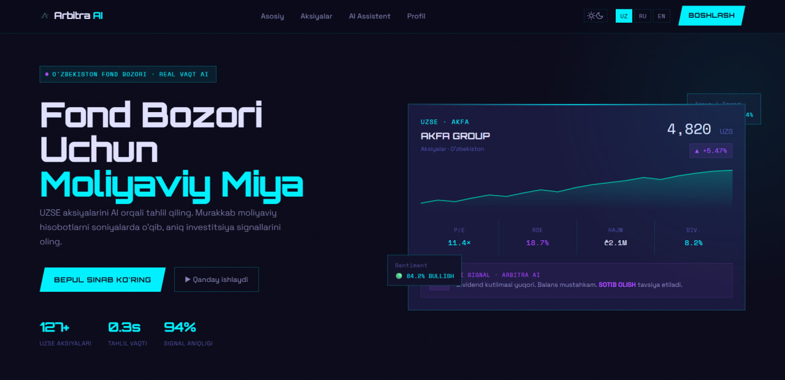

# Arbitra AI — O'zbekiston Fond Bozori Moliyaviy Razvedkasi



**Arbitra AI** — bu O'zbekiston fond bozori (UZSE) ma'lumotlarini real vaqt rejimida tahlil qilish va investorlarga aqlli signallar berish uchun yaratilgan yuqori texnologik B2B platforma. 

Loyiha murakkab moliyaviy hisobotlarni "o'qiydi", bozor kotirovkalarini skanerlaydi va Google Gemini 2.0 Flash yordamida aniq investitsiya tavsiyalarini shakllantiradi.

## 🚀 Asosiy Imkoniyatlar

- **Real-Vaqt Tahlili:** UZSE ma'lumotlarini avtomatik yig'ish va qayta ishlash.
- **AI Assistent:** Gemini 2.0 Flash asosidagi miya, u bozor kontekstini tushunadi va savollaringizga javob beradi.
- **Interaktiv Grafiklar:** Narxlar tarixi, hajm tahlili va texnik indikatorlar bilan jihozlangan professional terminal.
- **Portfolio Dashboard:** Foydalanuvchi aktivlarini kuzatish va foyda/zarar tahlili uchun shaxsiy kabinet.
- **Multilingual:** O'zbek, Rus va Ingliz tillarida to'liq qo'llab-quvvatlash.
- **Cyber-Terminal Design:** Premium va zamonaviy "Dark Mode" interfeysi.

## 🛠 Texnologik Stek

- **Frontend:** HTML5, Tailwind CSS, JavaScript (ES6+), Chart.js.
- **Backend:** Flask (Python) — yengil va tezkor API xizmati.
- **AI Integration:** Google Generative AI (Gemini 2.0 Flash API).
- **Data Sourcing:** Custom Web Scraper (BeautifulSoup4, Requests).
- **Environment:** Dotenv orqali xavfsiz kalitlarni boshqarish.

## 📦 O'rnatish va Ishga tushirish

### 1. Muhitni tayyorlash
Loyiha uchun Python 3.10+ talab qilinadi.

```bash
# Repozitoriyani yuklab oling
git clone https://github.com/LegionOken/hackhaton.git
cd hackhaton

# Virtual muhit yarating
python -m venv venv
source venv/bin/activate  # Linux/macOS
venv\Scripts\activate     # Windows

# Kutubxonalarni o'rnating
pip install flask httpx beautifulsoup4 requests python-dotenv
```

### 2. API Kalitni sozlash
Loyihaning ildiz papkasida `.env` faylini yarating va Gemini API kalitingizni kiriting:
```env
GEMINI_API_KEY=your_api_key_here
```

### 3. Ma'lumotlarni yangilash (Parser)
Bozor ma'lumotlarini yangilash uchun skriptni ishga tushiring:
```bash
cd frontend/parser
python main.py
```

### 4. Serverni ishga tushirish
```bash
cd ../../backend
python server.py
```
Server ishga tushgach, brauzerda `http://localhost:5000` manziliga kiring.

## 📂 Loyiha Tuzilishi

- `frontend/`: Veb-interfeys, CSS va interaktiv grafiklar.
- `backend/`: Flask serveri va AI integratsiyasi logicasi.
- `frontend/parser/`: Birja ma'lumotlarini yig'ish uchun skriptlar.
- `data/`: JSON formatidagi bozor ma'lumotlari.

## ⚠️ Ogohlantirish
Fond bozori va aksiyalar savdosi yuqori moliyaviy xavf bilan bog'liq. Arbitra AI bergan tavsiyalar faqat axborot maqsadida beriladi va moliyaviy maslahat hisoblanmaydi.

---
Developed by Logos❤️ for AI Hackathon 2026.
